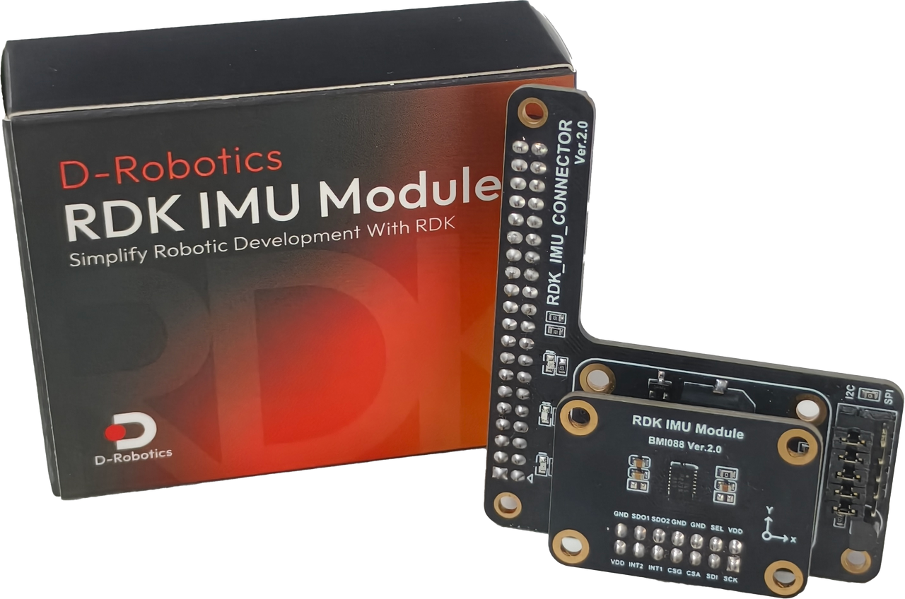
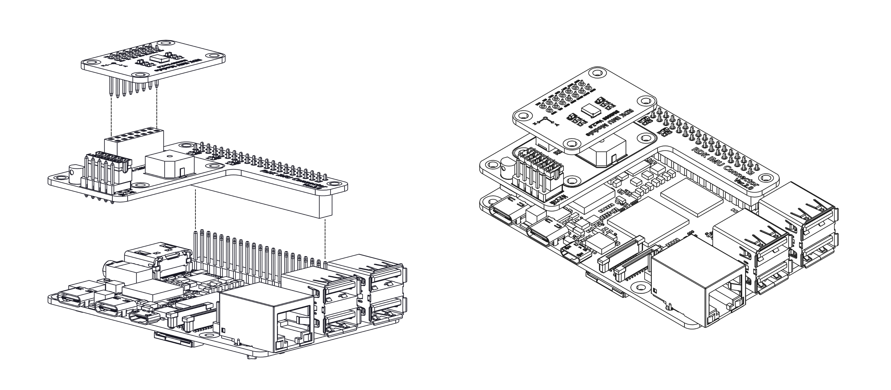
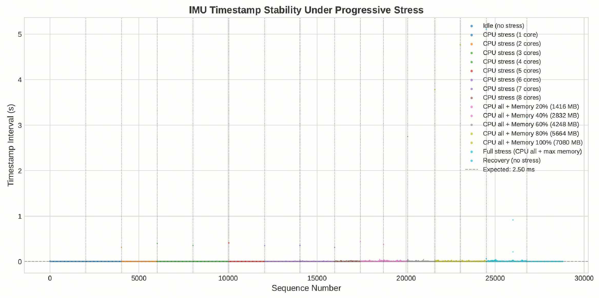

<div align="center">
  <a href="https://developer.d-robotics.cc">
    
  </a>

简体中文 | [English](README.md)

# RDK IMU Module SDK

RDK IMU 模组采用 Bosch Sensortec 推出的高性能 6 轴惯性测量单元（IMU）BMI088 实现，包含一个三轴陀螺仪和一个三轴加速度计，均为 16 位精度。BMI088 专为要求高精度和抗振性能的应用场景而设计，尤其适合无人机、机器人等强震动环境中使用。BMI088具备 ±24g 加速度和 ±2000°/s 角速度的扩展量程。BMI088 具有优异的温漂表现（低 TCO/TCS），出厂已校准，可实现高稳定性的姿态与运动感知。



rdk-imu-module-sdk 是 D-Robotics 为 RDK IMU 模组开发的软件开发工具，包括 C 语言、Python 和 ROS2 部分。无需系统驱动，支持硬件时间戳，构建简单，开发者可以使用本 SDK 选择自己喜欢的开发方式，快速体验 RDK IMU 模组功能，并基于本 SDK 进行二次开发，快速构建自己的机器人应用开发项目。

</div>

---

# 🚀 快速体验

## 1. 硬件连接

以 RDK X5 为例，连接方法如下：

<div align="center">



</div>

---

## 2. 环境依赖

安装 Python 构建工具

```shell
pip install setuptools wheel
```

安装 colcon build 工具

```shell
sudo apt update
sudo apt install python3-colcon-common-extensions
```

安装 stress-ng 工具

```shell
sudo apt update
sudo apt install stress-ng
```

---

## 3. 示例运行

### C 示例运行

在 `./core` 目录下输入 `make` 以进行全量构建。

此时 `sudo out/test` 即可启动测试用例，中断会打印输出 IMU 的帧 ID、六轴数据、时间戳、软件 FIFO 余量以及实时频率统计。

或者直接使用 `make test` 快速执行示例。

使用 `make install`/`make uninstall` 以将头文件和动态链接库安装到系统环境中或卸载。

---

### Python 示例运行

在 `./core` 目录下输入 `make install` 以进行全量构建，并将编译生成的 `.whl` 和动态库安装到 Python Path中。

然后输入 `python3 examples/test_imu.py` 即可运行 Python 示例。

---

### ROS2 示例运行

首先需要激活 ROS2 环境。

```shell
source /opt/xxx/xxx/setup.bash
```

在 `./ros2` 目录输入 `colcon build` 以编译 ROS2 功能包。
> 必须保证 `core/lib/librdkimu.so` 等文件存在才可编译

编译完成后，输入 `source install/setup.bash` 安装编译的功能包。

使用 launch 方式启动 IMU 数据节点。

```shell
ros2 launch rdk_imu_module rdk_imu.launch.py
```

另起一个终端，激活 ROS2 环境后可以使用 `ros topic` 命令验证 IMU 数据话题情况。

```shell
source /opt/xxx/xxx/setup.bash

ros2 topic echo /rdkimu/data
ros2 topic hz /rdkimu/data
```

---

# 📚 使用文档

SDK 的具体说明请查阅 [D-Robotics 开发者社区](https://developer.d-robotics.cc)。

使用文档说明了 SDK 的原理、构建、API和注意事项等。

---

# 💪 性能参数

RDK IMU Module SDK 支持对 IMU 进行参数调整，可选参数与 BMI088 手册一致，但在调节 ODR 频率时，需要结合使用的通信接口速率来调整ODR。

## 对于 I2C

I2C 总线的加速度计与陀螺仪 ODR 之和估算公式为：

$$
\text{ODR}_{\text{sum}} \approx \frac{f_{\text{I2C}}}{2 \times N_{\text{read}} \times 9}
$$

其中：
- $f_{\text{I2C}}$：用户设定的 I2C 总线速率（单位：Hz，标准模式 100 kHz）；
- $N_{\text{read}}$：单次批量读取时，总线上需要传输的数据字节数，此处为 **6 字节**（三轴 × 16 位）。

**示例**：对于 RDK X5 默认 I2C 速率 $f_{\text{I2C}} = 100\,\text{kHz}$，理论最大 ODR 之和约为：

$$
\text{ODR}_{\text{sum}} \approx \frac{100000}{2 \times 6 \times 9} \approx 1042\text{Hz}
$$

因此，加速度计与陀螺仪 ODR 频率的和不应大于 $1042\text{Hz}$。  
实际应用中，还需考虑总线其他设备、中断响应延迟等因素，建议留出部分余裕量。

### 对于 SPI

SPI 总线的加速度计与陀螺仪 ODR 之和估算公式为：

$$
\text{ODR}_{\text{sum}} \approx \frac{f_{\text{SPI}}}{ (B_{\text{accel}} + B_{\text{gyro}}) \times 8 }
$$

其中：
- $f_{\text{SPI}}$：用户设定的 SPI 时钟频率（单位：Hz，例如 1 MHz）；
- $B_{\text{accel、gyro}}$：读取加速度计和陀螺仪时，单次 SPI 传输的总字节数，此处为 7 和 8。

**示例**：对于 RDK X5 默认 SPI 速率 $f_{\text{SPI}} = 1\,\text{MHz}$，理论最大 ODR 之和约为：

$$
\text{ODR}_{\text{sum}} \approx \frac{1000000}{ (7 + 8) \times 8 } = \frac{1000000}{112} \approx 8333\text{Hz}
$$

## 硬件时间戳

RDK IMU Module SDK 的时间戳来自用户态的硬件中断，基于 `gpiod` 提供的硬件时间戳实现，下图是在 CPU 占用与内存带宽 双重压力测试下的 IMU 时间戳间隔曲线。

<div align="center">
    
</div>

---

# 📜 许可证

本项目基于 **MIT License** 开源，详见 [LICENSE](LICENSE) 文件。

# 📩 联系方式

如有疑问或建议，欢迎通过以下渠道联系我们：

开发者社区：https://developer.d-robotics.cc

---

# 🏷️ 版本发布

| **版本号** | **发布日期** | **主要变更** |
|--------|----------|----------|
| `v1.0.0` | 2026.6.10 | 功能发布：支持 6 轴融合输出、硬件时间戳 |

---

<div align="center">

**Copyright (c) 2026 D-Robotics.**

</div>